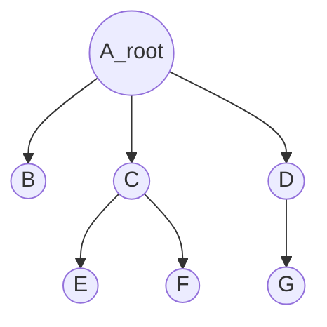
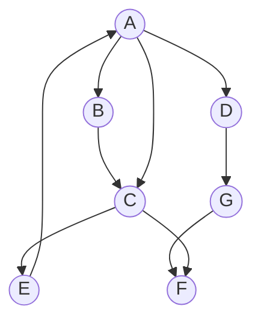
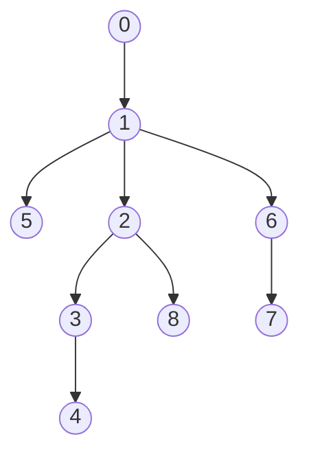
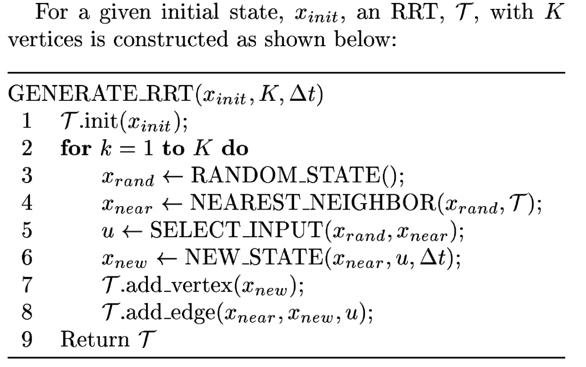
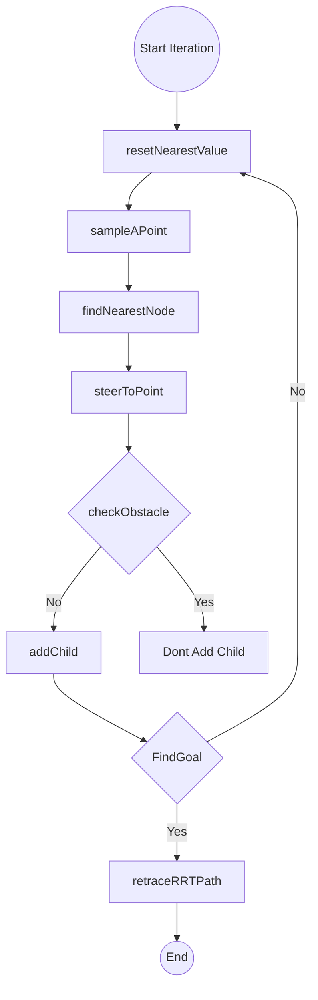
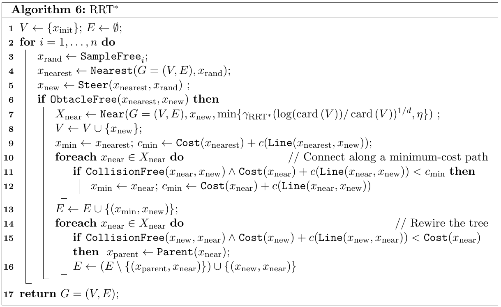

# This code for implement the RRT motion planning for robotics toolbox
## 1. Tree vs Graph Structure
The main differences between a tree and a graph are as follows:

__Tree:__
- A tree is a special type of graph that is connected and acyclic, meaning that there are no cycles in it.

- It is a hierarchical data structure where each node has only one parent, except for the root node.
A tree has exactly one root node.
- In a tree, there is only one path between any two vertices.
- Loops and self-loops are not allowed in a tree
- Trees are often used to represent hierarchical relationships between nodes.

Example the Tree structure:


__Graph:__
- A graph is a collection of vertices (also known as nodes) and edges that connect these vertices
It can have more than one path between vertices. 
- Graphs can be directed or undirected, meaning that edges have a specific direction or they do not.
- Graphs can have loops and self-loops.
- There is no concept of a root node in a graph.
- Graphs are more flexible and can represent various types of relationships and connections.

Example the Graph structure:


In summary, a tree is a special type of graph that is connected (undirected graph), acyclic, and has a hierarchical structure, while a graph is a more general data structure that can have loops and self-loops and does not have a hierarchical structure.

---
## 2. Depth first search algorithms

Depth-first search (DFS) is an algorithm for traversing or searching tree or graph data structures. The algorithm starts at the root node (selecting some arbitrary node as the root node in the case of a graph) and explores as far as possible along each branch before backtracking. Extra memory, usually a stack, is needed to keep track of the nodes discovered so far along a specified branch which helps in backtracking of the graph. [wiki](https://en.wikipedia.org/wiki/Depth-first_search)
Finding the connected components. 
Video explain and code [1](https://www.youtube.com/watch?v=PMMc4VsIacU)

__DFS Pseudocode__
```python
# Initially all vertex are False
marked = [False]*Graph.size()
def dfs(Graph,vertex):
    visit(vertex)
    # label v as discovered -> marked= True
    marked[vertex] = True
    # for all directed edges from v to w that are in Graph.neighbors(vertex):
    for w in Graph.neighbors(vertex):
        if not marked[w]:
            dfs(Graph,w)
```
__Example a Tree structure:__


We have the adjacency list 
```
graph = {
        0: [1],
        1: [0, 2, 5, 6],
        2: [1, 8, 3],
        3: [2, 4],
        4: [3],
        5: [1],
        6: [1, 7],
        7: [6],
        8: [2]
    }
```
Following is the Depth-first search code ```DFS_simple.py``` we have the solution:
```
 [0, 1, 2, 8, 3, 4, 5, 6, 7]
```


---
## 3. RRT Original Algorithms


The RRT code Pseudocode:
```
Qgoal //region that identifies success
Counter = 0 //keeps track of iterations
lim = n //number of iterations algorithm should run for
G(V,E) //Graph containing edges and vertices, initialized as empty
While counter < lim:
    Xnew  = RandomPosition()
    if IsInObstacle(Xnew) == True:
        continue
    Xnearest = Nearest(G(V,E),Xnew) //find nearest vertex
    Link = Chain(Xnew,Xnearest)
    G.append(Link)
    if Xnew in Qgoal:
        Return G
Return G
```
---
Flow chart:

---
## 4. RRT* Original Algorithms

## References
1. Depth First Search (DFS) Explained: Algorithm, Examples, and Code [link](https://www.youtube.com/watch?v=PMMc4VsIacU)
2. Depth First Search Wiki [link](https://en.wikipedia.org/wiki/Depth-first_search)
3. Depth First Search (DFS) in Python [link](https://www.scaler.com/topics/dfs-python/)
4. Udemy course the introduction sampling based motion planning algorithms [link](https://www.udemy.com/course/an-introduction-to-sampling-based-motion-planning-algorithms/l)
5. TreeNode - Nonlinear Data Structure [Link](https://www.codecademy.com/learn/nonlinear-data-structures-python/modules/trees-python/cheatsheet)
6. Useful Python Implementation of Rapidly-exploring random tree (RRT) Path-planning Algorithm from Fanjin Zeng [link](https://gist.github.com/Fnjn/58e5eaa27a3dc004c3526ea82a92de80)